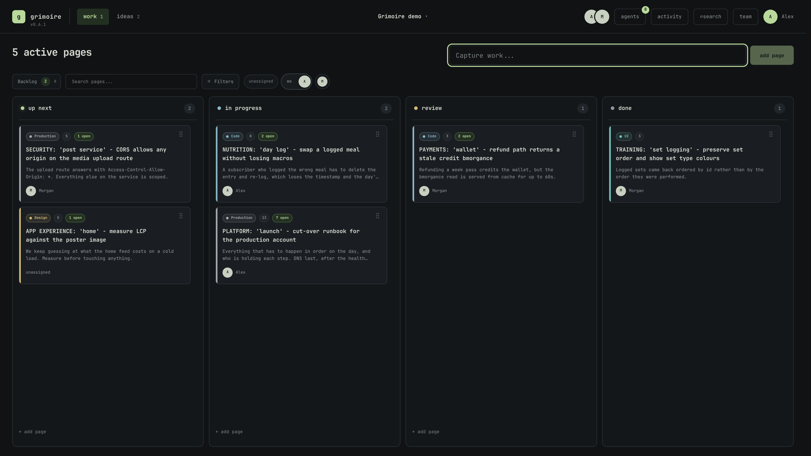

# Grimoire

A self-hosted work board for people and their agents, with Markdown you own.

[](https://github.com/donavynhaley/grimoire/actions/workflows/ci.yml)
[](LICENSE)
[](https://github.com/donavynhaley/grimoire/releases)



Try an editable playground at `/demo` on any Grimoire installation, or choose **Try the demo** on its sign-in screen.
Changes stay in your browser tab; no account is required.
See [the demo guide](docs/demo.md) for storage and feature boundaries.

## Run it

With Docker Engine and the Compose plugin installed:

```sh
git clone https://github.com/donavynhaley/grimoire.git
cd grimoire
docker compose up -d --build
```

Open **http://localhost:8080** and create the owner account.
Your accounts, discussions, pages, and attachments persist in `./data`.
For a remote host, put HTTPS in front of Grimoire before signing in or sharing the address; the [self-hosting guide](docs/self-hosting.md) covers proxies, tunnels, and configuration.

## Why Grimoire

Keep possible ideas in the garden and committed work on the board.
Pages and ideas are ordinary Markdown files, so the work stays readable outside Grimoire and can live in an Obsidian vault or a Git repository.
Discussions stay beside each page, with open questions and answers that survive the handoff.

Give an agent a project-scoped credential through the [MCP server](packages/grimoire-mcp).
Its work is attributed to the person who delegated it, and its access can be revoked immediately.
People retain control over membership, project structure, and destructive actions.
Grimoire has no telemetry and runs on your infrastructure.

[Self-hosting](docs/self-hosting.md) · [Agent setup](packages/grimoire-mcp) · [Contributing](CONTRIBUTING.md) · [Architecture](docs/architecture.md)

## How the board works

Chapters optionally group pages into named stretches of work, and estimates are there for projects that want them.
Closing a chapter lets you decide where unfinished work goes.
The sections below describe the product's behavior and the reasons behind it.

## Work

A unit of work is a **page**, and a project's pages are grouped into chapters when it uses them.
Pages were called cards until the vocabulary caught up with the rest of the product.
The older `/api/cards` routes still answer, so a browser still running a previous build keeps working, and each project's `cards/` directory is renamed to `pages/` the first time the newer version starts.

Grimoire keeps the main board limited to the work that currently deserves the team's attention:

- **Up Next** contains the small set of pages that someone can pick up now.
- **In progress** shows what the team is actively working on.
- **Done** shows the eight most recently completed pages.

Accepted work outside the active deck lives in a searchable Backlog library instead of occupying a permanent board column.
The library can be filtered by category, assignee, or blocked state, and any page can move into Up Next with one action.
Moving a page into Up Next keeps the library open so several pages can be selected in one pass.
Pages can be dragged between active columns, reordered within a column, or dropped onto the Backlog control.
Neighbouring pages glide aside as the drop target moves rather than snapping, and the motion is suppressed when the system asks for reduced motion.
Press `B` while focus is on the board to open the Backlog library.

Clicking the Done heading opens the complete searchable history, grouped by completion month and filterable by category or assignee.
Completed pages are never automatically archived or deleted, and any completed page can be reopened into Up Next.
Moving a page into Done records its completion time, editing it preserves that time, and reopening it clears the completion time.

Every page can contain a title, optional notes, and one assignee.
Notes are written in Markdown on a single surface that is always rendered and always writable, the way Obsidian's Live Preview works.
Headings, emphasis, links, lists, task checkboxes, quotes, tables, rules, code, and embedded screenshots display as what they produce rather than as syntax, and the Markdown that produced any of it appears only on the line the caret is on.
There is no reading mode and no editing mode to switch between: clicking puts the caret where it was clicked, and moving away lets that line settle back into what it says.
A table is drawn as a table, and grown as one: quiet controls add a column or a row, and clicking any cell puts the caret in that cell rather than at the top of the block.
Both rewrite the block and lay the source out square again, the same tidying Obsidian does.
A table being written in shows its rows as text, since no arrangement of hidden pipes turns source rows into columns.
Task checkboxes are live controls while their line is at rest and plain `[ ]` once the caret arrives, so a list can be ticked with the pointer and rewritten with the keyboard.
Links in notes open in a new tab without disturbing the page.
`Cmd/Ctrl+B` and `Cmd/Ctrl+I` wrap the selection, pasting a URL over chosen words links them, Enter carries a list on, and Escape leaves the surface without closing the panel behind it.
Pasting or dropping a screenshot into the notes uploads it to the project's `images/` directory and embeds it with Obsidian's `![[name]]` syntax, including support for Obsidian's `![[name|300]]` display sizes.
The whole notes field accepts drops wherever the caret happens to be, and highlights while a file is dragged across it.
Because the embed resolves by file name, images keep working when a page is archived, restored, or promoted from an idea, and they render natively if the project directory lives inside an Obsidian vault.
Board and library tiles reduce notes to plain text so Markdown syntax never clutters a preview.
Idea notes work the same way in both the idea dialog and the garden tiles.
Assignees are visible directly on the board so the current team focus is clear at a glance.
Each page can also have one game-development category: Design, Code, Modeling, Texturing, Animation, Narrative, Audio, UI, VFX, or Production.
Category color rails and compact labels make different disciplines visible without turning categories into another workflow.

Pages can be blocked by other pages.
The board shows a blocked marker while any linked blocker is not Done, and the marker resolves automatically when the blocking work is completed.
Dependency cycles, self-links, and archiving an unfinished blocker with active dependents are rejected.
Archiving a page offers an eight-second undo action.
Undo restores the page to its prior place and reconnects dependency links that the archive removed.

Status and assignee changes use direct buttons instead of dropdown menus.
On touch devices, the same compact status buttons provide an alternative to dragging.

The work capture reveals compact category, assignment, and column controls after typing begins.
Typing `#`, `@`, or `/` opens the matching picker without leaving the keyboard, and the command text is removed from the saved title.
After a configured capture, a temporary `same settings` action can restore its category, assignment, and column for another related page.

Columns stack into a single vertically scrolling page on tablet and phone widths, so the board never scrolls sideways.

Press `/` anywhere to search the whole project at once.
The overlay covers every column, the backlog, the idea garden, completed work, and pages that were archived, and it reads note bodies as well as titles.
Results are grouped by where each one lives, so a match is a place to go rather than a bare row, and selecting one opens it in its home view.
Archived pages are listed with the text that matched.
They cannot be opened, because an archived page has no editable place to return to, so their row carries a `restore` action instead.
Restoring puts the page back in the column and position it was archived from and opens it, which is the only honest answer when that column is one the board does not draw.
Search is the only route back into the archive once the eight-second undo after archiving has passed.

The filter bar beside the Backlog control narrows the four visible columns rather than searching everything.
When a filter matches work the board has no column for, a line beneath it says how much is waiting in the Backlog or further back in Done, and opens the full search on the same query.

The visible filter bar can focus the board on unassigned work or work assigned to any team member, including the signed-in person.
Search and people filters combine, and the current view is stored in the URL so a useful view can be bookmarked or shared.
The open page or idea is part of the URL too, so copying the address bar sends a link that opens that exact page in the right view for any signed-in teammate.
Dragging remains available while filters are active, and visible drop targets map back to the full column order.
Press `1` for Work or `2` for Ideas globally or from an empty capture field.
An open dialog keeps the keyboard to itself, and `Escape` closes whichever one is in front.

## Chapters

Chapters are off until a project turns them on, and a project that never does sees no trace of them.

A chapter is a named stretch of the project's work, with optional dates, that a page can belong to.
It answers what the team was working on and roughly when, never how much was committed to.
There is no capacity, no burndown, and no forecast: a project that leaves Estimates off has no numbers in it at all.
Dates are descriptive rather than binding: a chapter with neither a start nor an end is still a chapter, and one whose end date has passed keeps running until somebody closes it.

At most one chapter is open at a time.
Opening another closes the current one, as one deliberate action, which keeps chapters meaning "what are we working on now" rather than becoming a grid of parallel workstreams.
Any number of chapters can be planned ahead or kept after closing.

Belonging to a chapter is independent of a page's column.
A page can sit in the Backlog while already belonging to a chapter, so a chapter can be filled without flooding Up Next, and Up Next stays the small set of pages someone can pick up now.
The Backlog library gains a chapter filter and a one-click way to add any page to the chapter currently being viewed.

Closing a chapter never moves a page by itself.
It asks what should happen to the work that did not land, and every answer is a named choice: roll it into the next planned chapter, move it to a chapter named exactly, release it, or leave it here.
Dismissing the question does nothing, and no page is ever carried forward automatically.
Rolling over moves only what is unfinished, so a page finished inside a chapter stays in the chapter that finished it.
Whatever the answer, the chapter records how many pages it could not finish and where they went, counted as it closes: once the pages belong to the next chapter, nothing about them still says they were carried out of this one.

## Estimates

Estimates are off until a project turns them on, and a project that never does carries no estimate on any page.

An estimate is one whole number on a page saying how much work it is, in whatever unit the team means by one.
Nothing multiplies it, forecasts from it, or rolls it up on anyone's behalf.
A page nobody has estimated is not zero, and the two are never confused: the totals below count unestimated pages separately.

With chapters on as well, each chapter adds up what it delivered - the estimates of pages finished while they belonged to it - alongside what it still holds open.
Because rollover moves unfinished work onward, a page that carried over is counted by whichever chapter actually finished it, not the one that hoped to.
That is the whole of velocity here: a sum of what happened, shown beside the chapter it happened in, with no line drawn through it and no next number predicted.

With chapters enabled, the work filter bar grows a chapter picker.
It lists the open chapter first, then planned ones, then closed ones newest first, alongside "All work" and the pages nobody has placed.
The board opens on the open chapter, so arriving lands on the current work, and "All work" is always one click away so the picker can never hide the project.
The selection is stored in the URL beside the search and people filters, so a chapter view can be bookmarked or shared.
Selecting a chapter replaces the page count above the board with the chapter's name, its dates, and what it is for.

Typing `~` in the capture field sets a chapter without leaving the keyboard.

## Ideas

The Idea garden keeps possibilities away from the work backlog until the team deliberately commits to one.
Every new idea lands in the Inbox and can move directly to the manually ranked Shortlist or to Parked.
Shortlisted ideas can be dragged into priority order without adding scores, votes, or ceremony.
Parked ideas remain searchable and recoverable without competing for attention.

Promoting an idea creates one Backlog page with the same title and Markdown notes.
The source idea is archived with a stable link to the created page, so the decision remains traceable without duplicating active content.
Promotion also offers an eight-second undo action that restores the source idea and removes the generated page.
If anyone edits or links work to the generated page, Grimoire protects that work and refuses the undo.
Ideas do not have assignees or work statuses because they are not work yet.

## Collaboration

The first person to open a new Grimoire installation creates the admin account — the installation's one admin, and the owner of the project it starts with.
The first-run form starts empty and asks for that person's own email; nothing is prefilled, so an installation never inherits somebody else's address.
The project menu is a switcher: the projects, each with its one-line description, a collapsed "New project" field, and "Project settings".
Project settings is one dialog with a section rail — General, Categories, Page fields, Chapters, Team, Agent access, and a Danger zone — and the open section travels in the URL as `?settings=<section>`, so a reload or a shared link lands exactly where the reader was.
The header's `team` button is a shortcut into the same dialog, landed on its Team section.
Everything in settings saves as it is edited — on blur or Enter — and the dialog confirms each save with a quiet `saved` note in one fixed place; refusals appear in the same place and nowhere else.
General holds the project's name and its optional one-sentence description; categories and fields can be reordered; each chapter carries an editable intent line, the honest replacement for a sprint goal.
Members can open settings too and read every section an owner can reshape — the mutation controls, agent access, and the danger zone stay owner-only.
Archiving a project offers the same eight-second undo a page gets, and the Danger zone lists every archived project with a restore action, so archiving is no longer a one-way door.
An owner brings people onto a project from the Team section, in one of two ways.
Somebody who already has an account is added by their email address, and joins as a member of that project — nothing is sent, and the project is simply there the next time they look.
Somebody who does not yet have an account gets a single-use invitation link instead; only the newest unused invitation remains valid, and links expire after seven days.
The two are separate because an invitation only ever creates an account and refuses an address that already has one, so it can never be the way an existing teammate joins a second project.
The owner can also remove members from the Team section, which revokes their sessions and live connections and clears their page assignments without erasing their authorship history.

Accounts, sessions, invitations, project membership, and the activity log are stored in a local SQLite database.
Pages and ideas are stored as Markdown files with validated YAML frontmatter.
Passwords are protected with scrypt, and browser sessions use HttpOnly SameSite cookies.
After signing in, open the account menu from the top-right avatar to change your password or sign out.
Changing a password requires the current password and signs the account out on other devices.

Signed-in browsers receive project-scoped live updates whenever another browser changes work or ideas.
The browser that made a change applies its own response directly, while every other connected browser reloads the affected workspace from the canonical Markdown files.

Two people can hold the same page or idea open without either of them losing writing.
An open editor sends only the fields someone actually rewrote, so renaming a page never carries a stale copy of its notes along with it.
A field nobody is rewriting simply adopts the incoming version and says who changed it, instead of sitting on a copy that would collide later.
When two people do write the same field, the second save is refused rather than applied: the editor shows what it collided with and offers to keep either version, and nothing reaches the file until someone chooses.
The same protection covers edits made outside Grimoire, so a change written straight into the Markdown by another editor survives a rename made in the browser.
Moving a page between columns or reordering one carries no text, so those stay immediate.

Teammates with the project open are ringed in green on the people filter bar and in the Team section of settings.
Presence is deliberately absent from the header, where it would mostly report the signed-in person back to themselves.
It follows the live connection itself, so it clears as soon as someone closes the tab or loses their network.

## Discussion

Every page carries a discussion, and it is not the same thing as its history.

The history is derived: the system wrote it, it is about the page, and it belongs to nobody.
A discussion message is authored, is addressed to somebody, and is finished only once it has been answered.
Putting them in one list would bury what somebody said under the column moves around it, and leave a page with a conversation on it reading like a changelog.
So discussion takes turns with the page's properties in the second column, rather than adding a third.
Nobody weighs an estimate and answers a question in the same breath, and giving the two of them one column between them is what keeps the writing column exactly the width it has always been.
A switch at the top of that column says which of them is showing, and it starts on the properties: a page opens on what it is, not on what was said about it.

Nothing resizes when it swaps, so there is no layout change to travel and no third track to hold open at zero width - which is the whole reason this shape is simpler than a column that folds.
Threads inside it need no card or border, because the column is what tells them apart from the history in the writing column; a thread is a name, a time, and what was said, ruled off from the next one.
Reply and answered are revealed on hover, so a page carrying nine open threads is nine questions rather than nine questions and eighteen buttons.

A message with no parent opens a **thread**; every other message answers one.
There is no third level: one indent is enough for a team talking about one page, and a second turns a thread into a tree nobody scans.

A thread has exactly one piece of state - **open**, or **answered** - and that state is what keeps the surface small.
Answered threads fold behind a count, so a page with forty messages on it still shows the two that are live.
Nothing is deleted to get there, and reopening a thread costs one click and leaves a line in the history.

Writing `@` and somebody's name addresses them.
The people on the project are offered as the name is typed, and choosing one writes it into the message; who was meant is resolved once, when the message is written, and stored as an account id beside it.
The text keeps whatever was typed, because a body is a quote and quotes are not rewritten - but being renamed never changes who a message was addressed to, and an id is also what a relay to somewhere else would need, since `@Alan` means nothing to Discord and an account can be mapped to one.
Your own name is filled in where it appears; everybody else's is only marked enough to read as addressed.

It is a discussion and nothing more.
Nothing here works out whose turn it is or marks a thread as owing somebody an answer: two people talking about one page do not need to be told who should speak next, and saying so on every other thread turns reading a page into being chased.
Replying does not close anything either, because saying something and having said enough are different claims and only the second is a thread's state.

A board tile shows how many threads on a page are still open, and shows nothing at all when none are.

The switch that turns to it counts something different: **how many messages you have not read**, and says whether any of them named you.
An open thread you have already read is not news, and a reply to a question you asked is, even though it closed nothing - so the number that decides whether to look now is the unread one, and resolved-ness is left to the tile.
Your own writing never counts, a page you have never opened counts everything on it, and turning the column to the conversation is what marks it read.
Like every other seen marker here it is private: it moves your count and nobody else's, and tells nobody how caught up you are.
The number is what is new; the accent on it is that some of it was addressed to you.

Discussion lives in SQLite beside the activity log rather than in the page's Markdown.
A page file is portable and editable outside Grimoire, and a conversation folded into its body would be rewritten by the first external editor that touched it.
That is the same choice the activity log already makes, and it has the same consequence: discussion is visible in Grimoire and nowhere else, including inside an Obsidian vault.

## While you were away

Opening a project after time away starts with a digest strip above the board: at most five human sentences describing what teammates changed, with the changes about you - new assignments and blockers that resolved - always first.
`+ N more` expands the strip in place, and dismissing it removes it completely for this visit.
Every page and idea changed while you were away carries a small accent dot; opening it clears its dot, dismissing the digest clears them all, and the next visit always starts clean.
The summary is driven by a private per-person cursor over the activity log, so nobody can see how caught up anyone else is, and your own actions never appear.
The cursor only advances while the tab is actually visible, so changes that arrive behind a hidden tab stay unseen until you return.
There are no emails, notifications, or push messages - Grimoire waits until you visit.

## Activity

The `activity` control in the header opens the project's history for the project owner, newest first and grouped by day.
Owners also see an unseen-change count on the control, and inside the history a `new since your last visit` line marks how far back to read.
Members keep the per-page history inside each page dialog; the project-wide log and its API are owner-only.
It records who created, edited, moved, archived, restored, and promoted every page and idea, along with project renames, category changes, invitations, joins, and removals.
Each entry names the fields that changed and what they changed from and to, and selecting a page entry opens that page.
Opening a page also shows its own recent history above the archive action.

Reordering a page inside a column, or reranking the shortlist, is not recorded, because a log shaped by dragging would bury the changes worth reading.
The history is kept in SQLite rather than the Markdown files and is never pruned.

## Page fields

A project can give its pages extra properties of its own — a priority, an estimate, a due day, whatever it tracks.
Fields are defined in Project settings in five shapes: text, a number, a choice from a fixed list, a day, or yes/no.
Grimoire names none of them, and nothing here is counted, added up, or rolled over: a number field is a number someone wrote down.

A choice offers itself two ways, and a field can be switched between them at any time by clicking its type in settings.
As buttons it shows every option at once, which is right until the list outgrows the rail; as a searchable choice it rests as its value and opens into a box you type into.
Nothing stored moves either way — they share an option list and a validator, and only the control changes — which is why this is the one type change allowed at all. Every other one is still refused, because the values written under a field were written to satisfy the type it had.

A field can be marked to show on board tiles, so a project can carry more than it puts on the board.
Renaming a field leaves every value alone.
Deleting one, or withdrawing a choice from a list, clears the values it left behind and says how many, rather than leaving pages holding an answer the project no longer offers.

## Team and roles

There are two roles, and they answer different questions.

**Owner** belongs to a project. Whoever creates a project owns it, and an owner decides its shape — its name, categories, chapters, fields, agent access, and membership — while everyone on it can work on pages and ideas.
An owner can promote another member of that project to owner, or demote one, from the Team section of settings.
That reaches the project it was granted on and nothing else: it adds nobody to any other project, and it cannot be taken away from somewhere it was never given. Being an owner somewhere is not a reason to be shown a project you are not on, and the project picker offers exactly the projects you are on.
Changing your own role is refused: the one case worth allowing is a project's sole owner demoting themselves, which leaves nobody who can ever promote anyone again.

**Admin** belongs to the installation, and there is exactly one — whoever set it up.
The Team section marks them with an `admin` badge beside their name, separately from whatever role they hold on the project being looked at.
The admin reaches every project and can reshape any of them, which is what keeps an installation from being stranded behind an owner who has gone quiet. No route grants the role and none takes it away: the admin cannot be demoted or removed from a project by anybody, including a project's own owner.
Nobody else is account-wide anything. Everyone else earns what they can do per project.

The account that creates a project is written in as its owning member, and that is the one membership no removal may delete, so a project is never left with nobody who can reach it.

An installation created before these were separate is reconciled once on the first start after upgrading: the first account becomes the admin, every other account becomes a plain member, and each project is handed to whoever created it. Owner rows on projects somebody did not create are dropped, because the old promotion wrote the role across every membership a person held rather than the one project it was granted on.

## Signing in

Grimoire signs people in with an email and a password, and it always will. Accounts are invitation-only: the owner of a project makes a link, and the person who follows it makes their account on it.

**Single sign-on is included, it is free, and it is a screen rather than a redeploy.** Open Settings → Sign-in as the admin, paste your provider's address, and press check: Grimoire reads the provider's own configuration and tells you what it found. Add the client id and secret — the two things no provider will tell us — and turn it on. Any OpenID Connect provider works, because Grimoire talks the protocol rather than a list of vendors: Authentik, Keycloak, Authelia, Pocket ID, Entra, Google.

That screen shows the redirect address to register with your provider, ready to copy. It is the value these setups get wrong more than any other, and it is not a value anybody should have to work out from their own hostname, port, and proxy.

The same settings can be pinned in the environment for a deployment that describes itself in a file. Anything set there wins, and the screen becomes read-only and says so, so the two can never disagree. See [docs/single-sign-on.md](docs/single-sign-on.md) for a walkthrough per provider.

The flow is authorization code with PKCE. The code is exchanged server to server, so no token passes through the browser, and the identity token is checked against the provider's published signing keys before a word of it is believed — issuer, audience, expiry, and the nonce that ties it to the browser that started the sign-in.

An account is found by email. Somebody who has been signing in with a password keeps their history, their memberships, and their name the moment single sign-on is turned on; the provider signs them in, it does not replace them, and their password keeps working beside it. That first match is then written down against the provider's own id for them, so somebody whose address changes at the provider stays the person they were here instead of quietly getting a second, empty account on the day they changed it. Somebody with no account gets one on first sign-in, because a team that has pointed Grimoire at their own provider has already said who is allowed in, and asking each of them to also click an invitation link is asking the same question twice. Name your **allowed email domains** whenever that provider is not only your team — pointed at Google or a shared tenant, the default means anybody with an account there. Turning auto-registration off keeps Grimoire invitation-only.

Password sign-in is never disabled by configuring a provider, and the first-run account is always made with a password. That account is the one that can never be locked out of its own instance, and an identity provider that has gone down should not be able to take an installation with it.

Failed sign-ins are rate limited, counted both against the address they came from and against the account they name. The address count is the tight one, and the account count is deliberately loose — anybody who knows a colleague's email could otherwise spend that colleague's allowance on purpose and keep them out of their own board. Behind a reverse proxy or a tunnel, set `GRIMOIRE_TRUST_PROXY=1` so the count follows the visitor rather than the proxy.

Every response carries a Content-Security-Policy. The build ships no inline script and Grimoire calls nothing off its own origin, so script may only come from Grimoire itself and a page has nowhere to load an injected one from.

## Agent access

A project can let something without a browser write in it, which is how an AI agent reaches Grimoire.
The owner issues a credential in Project settings, and its secret is shown once and stored only as a hash.

A credential is a delegation rather than an account.
It belongs to one project and one person, every write it makes is attributed to that person, and the agent that made it is named beside them, so the history reads `Donavyn, via Planning agent, added ...`.
Nothing is ever assigned to an agent, because an assignee is the person responsible and an agent is not responsible for anything.
An agent never appears in the people filter, the Team section, or presence, because presence follows an open connection and an agent holds none.

An agent may create and edit pages and ideas, place a page into an existing chapter, and read the board, search, and its issuer's activity log.
It may also read the discussion on any page and write in it, which is how an agent is meant to report: what it did, what it found, and what it needs decided go into a thread rather than into the notes, because the notes are the brief a person wrote for the work and rewriting them destroys what the agent was working from.
An open thread is how an agent asks a person something and is seen to be waiting.
It may never mark a thread answered - that judgement is a person's, and an agent that could close the question it raised could report its own work settled.
It may never archive, restore, promote an idea, manage chapters or categories, invite or remove anyone, change the project, or touch an account.
The rule is that an agent adds and refines, and only a person destroys or restructures, which keeps a mistaken or runaway agent a mess rather than a catastrophe.
A credential can also be issued read-only, its writes are rate limited so a loop stays interruptible, and revoking it stops the agent immediately while leaving everything it already wrote correctly attributed.
Archiving a project suspends its credentials the same way, so no agent outlives the board it was given.

[packages/grimoire-mcp](packages/grimoire-mcp) is an MCP server that gives an agent these abilities as tools.
Its tools take the names a person would use for a category, chapter, member, or column and resolve them, and it is a plain client of the API above rather than a second way into the data.

## Agent review

Work you delegate still has to be read by somebody, and the agent review is where that happens.
An `agents` control appears in the header whenever agents have done something nobody has looked at, says how much, and retires once a person has.
Opening it shows everything agents did since you last reviewed them, grouped page by page rather than as one stream, because a person reviews delegated work the way they review a branch: by the thing it touched.
Questions agents have asked sit at the top as waiting on a person, and they do not expire with a review - a question stays asked until somebody answers it.
The owner also sees the credentials behind the work, each one tap from revoked, so stopping an agent does not mean finding it in settings first.

The review keeps its own private cursor, separate from the away digest's, and it moves only when you close the review: merely having the board open never counts as having looked.
A first look starts from the beginning rather than the present, because delegated work is owed a whole record.
When more happened than one look can show, closing marks only what was actually shown, and the rest greets you next time.
Your own agents' work counts as news to you - the same reasoning the discussion's unread count follows - and no agent can read the review or advance its cursor, because no agent approves its own work.

## Local development

Node.js 24 or newer is required.

```sh
npm install
npm run dev
```

The Vite development interface is normally available at `http://127.0.0.1:5173`.
The collaborative API listens at `http://127.0.0.1:8080`.

To try a change on an actual phone, run the interface with `npx vite --host` and open the address Vite prints from a phone on the same network.
An emulated phone is close, but gestures - the held touch that lifts a page, the pull that dismisses a sheet - deserve a real thumb before they ship.

Configuration options are documented in [.env.example](.env.example).
The SQLite database is stored in `data/grimoire.sqlite` by default and is ignored by Git.
Canonical project files are stored beneath `data/pages` by default.
Set `GRIMOIRE_PAGES_DIRECTORY` to a directory inside a Git repository if the work and ideas should share its history.

See [docs/architecture.md](docs/architecture.md) for the storage boundary, page format, migration behavior, and editing guarantees.
See [docs/coding-standards.md](docs/coding-standards.md) for the standards contributions are held to, each with a citable ID.
See [docs/ui-standards.md](docs/ui-standards.md) for how interface work is built: motion, dialogs, accessibility, and CSS.
See [docs/self-hosting.md](docs/self-hosting.md) for running Grimoire on a host of your own: Compose, a reverse proxy or tunnel, configuration, backups, and keeping it current.

## Verification

```sh
npm test
npm run build
npm run test:e2e
```

The end-to-end suite holds the app against a real Chromium as both an emulated Pixel and a desktop: touch drags, tap-based moves, sheet gestures, and the desktop presentation those must not disturb.

The test suite covers authentication, secure password changes, single-use invitations, member removal, Markdown persistence, legacy migration, external edits, live project events, presence, the activity log, the active deck, Backlog search, project-wide search, completion history, reversible archives and promotions, categories, page dependencies, assignments, filtering, idea ranking, ordering, drag-and-drop interaction, Markdown note rendering, pasted note images, concurrent editing and refused overwrites, the while-you-were-away digest, markers, and seen cursor, chapters including the per-project gate, the single open chapter, closing a chapter with and without rollover, per-chapter velocity, and the compatibility of page files with a build that predates chapters, and agent access including project pinning, revoked and expired credentials, archived projects suspending their credentials, read-only scopes, the routes no credential may reach, a session outranking a bearer header, rate limited writes that survive a backwards clock step, use tracking on reads, credential events in the log under their own entity type, agent attribution rendered in the activity, page history and away surfaces, attribution surviving both revocation and a rebuild of the activity log, and the agent review: the whole record on a first look, a private cursor the away digest cannot move, partial review under the cap, agent questions waiting until a person answers them, the credential rail sent only to the owner with one-tap revoke, and both of its routes staying closed to agents.
It also covers signing in through an identity provider against a provider that signs real tokens with a real key, so the refusals below are the actual checking answering rather than a stub: a matched account keeping its own name and role, an unknown email refused, an invitation creating an account and still being single use, auto-registration landing somebody on a project, an address outside the allowed domains refused, an unverified email refused, a callback that did not start in this browser, a sign-in completed twice, a token issued for another application, answering another sign-in, expired, or signed with a key the provider never published, a return path that tries to name another origin, and the route being closed to agent credentials.
It covers the linking that makes turning single sign-on on safe on an installation that already has people in it: a password account signed in and keeping its own name and role, an address matched however it was capitalised, the password still working afterwards, an address changed at the provider following the person rather than stranding them, a change onto an address another account uses refused rather than merged, a second provider person claiming a linked account refused, a created account remembered the same way, somebody off every project refused link or no link, and the link recorded under the issuer the token asserts rather than the address somebody typed.
It covers setting that provider up as well: the redirect address the screen hands you, reading a provider's own configuration rather than transcribing it, a trailing slash and a pasted discovery URL naming the same provider, an address that is not a provider answering with a reason instead of a failure, a sign-in configured and working without a restart, a saved secret surviving every other edit on the screen, the screen being the admin's rather than a project owner's, the environment winning and saying so, and the whole surface closed to agent credentials.
Alongside those, the sign-in rate limit's separate allowances per address, its refusal to believe a forwarded address nobody vouched for, its survival of a backwards clock step, the cap on how many keys it will remember, and the content security policy on both the API and the page.

## Self-hosting

```sh
docker compose up -d --build
```

The Compose configuration exposes Grimoire on port `8080` and persists both SQLite identity data and Markdown pages in the local `data` directory.
The first visitor creates the owner account, so open it yourself before the address is shared.
Place Grimoire behind a TLS-enabled reverse proxy before inviting collaborators over the internet.
Production session cookies are marked Secure and require HTTPS.
Set `GRIMOIRE_TRUST_PROXY=1` when you do, so a failed sign-in is counted against the visitor rather than against the proxy every visitor arrives through.

Back up the `data` directory to preserve accounts, work, and ideas.
Do not run multiple Grimoire containers against the same SQLite file or project directory.
[docs/self-hosting.md](docs/self-hosting.md) covers the rest: the hardened Compose file, a tunnel instead of an open port, running without Docker, backups, and keeping an instance current.

## License

Copyright © 2026 Donavyn Haley.

Grimoire is free software under the [GNU Affero General Public License v3.0](LICENSE).
You can run it, read it, change it, and host it for whoever you like; if you run a modified version as a network service, the AGPL asks you to offer those users its source.

The one exception is `packages/grimoire-mcp`, the MCP server an agent talks to Grimoire through.
That is [MIT](packages/grimoire-mcp/LICENSE), because it is a client: it should be free to vendor into anything, including software that is not itself open source.

## Contributing

Pull requests are welcome; [CONTRIBUTING.md](CONTRIBUTING.md) covers getting set up, the three test suites, and what kinds of change are likely to land.
A first pull request is asked to sign the [contributor license agreement](docs/contributor-license-agreement.md).
It is a licence rather than an assignment — you keep the copyright in what you write — and it is what lets the project keep making licensing decisions later without having to find and ask every past contributor.
Signing is a single comment on the pull request; the CLA assistant asks for it and remembers the answer.
Security problems are reported privately instead, as [SECURITY.md](SECURITY.md) describes.
